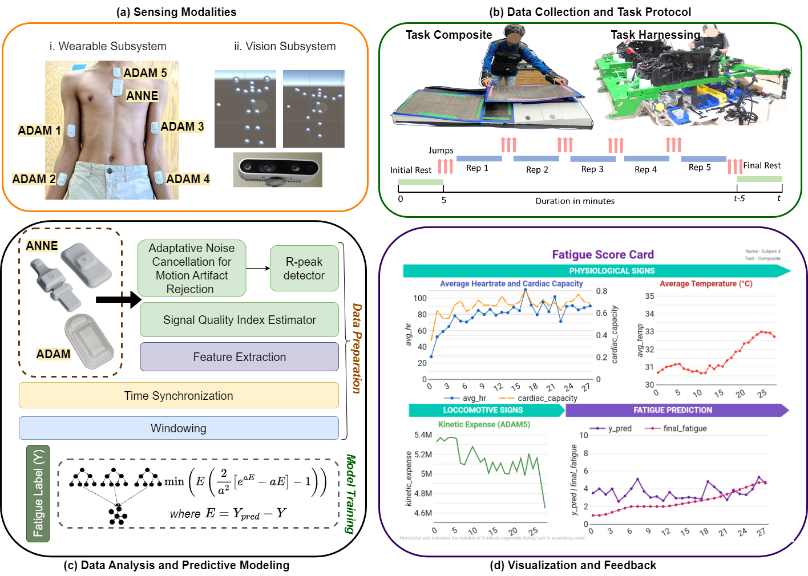

# Wearable Network for Multi-Level Physical Fatigue Prediction in Manufacturing Workers



## Setting Up the Environment

1. Clone the Repository :
   ```bash
   git clone https://github.com/payalmohapatra/WorkerFatigue.git
   cd WorkerFatigue
2. Create the Conda Environment:
Use the provided environment.yml file to create the Conda environment.

    ```bash
    conda env create -f environment.yml
    conda activate worker_fatigue
## Training
The models are trained using XGBoost Regressor under the following main settings :
1. Task specific training using all features from sensor fusion of 6 wearable sensors. Models are saved with prefix composite_* and ziptie_* for this setting.
2. Task independent training using all tasks and all features. Models are saved with prefix combined_vitals_* for this setting.

All the models are trained using two types of loss functions - asymmetric and Linex loss. Refer to ./Predictive_Models/Data_Analysis_Regression_fixed_Train_Test.ipynb for illustrations of the loss functions. The models are saved with suffixes of *_assym and *_linex respectively.

### Sample Data
Sample training data are present with suffix *_train and test data with fixed subjects left out of training with suffix *_test. These can be used to reproduce the results reported in the final report. 
For training, only sample data from a couple of participants are provided here. A fully trained model and a complete testset are provided to allow users to analyze the results. The statistics of training and test data are as follows :

* Train : 33 particpants for composite lay-up task and 27 participants for ziptie task
* Test : 8 participants from each task

The complete dataset can be downloaded by running the scripts here - MxD_Final_CodeBase/Data_Download_Scripts

## Helper Functions

The data preparation, segmentation, standardization are done here - ./Predictive_Models/helper_functions_user_study_2_0.py 

This is the central script repo for all helper functions used throughout the codebase. Please refer to this from the main script (./Predictive_Models/Data_Analysis_Regression_fixed_Train_Test.ipynb) for easy understanding.

## Model Checkpoints
All model checkpoints are stored here for quick analysis and inference - ./Predictive_Models/model_checkpoints

These models are trained on data collected at Northwestern University till 1 December 2022. 
